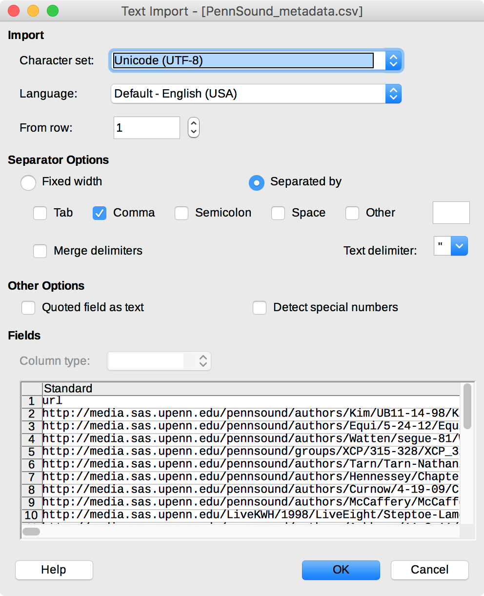

## PennSound Metadata Setup

- Install [LibreOffice](https://www.libreoffice.org/). (Editing this CSV with Excel will mangle the file.)

- Install [GitHub Desktop](https://desktop.github.com/) and create a GitHub account if you don't already have one.

- On the [GitHub page for this repo](https://github.com/stevemclaugh/pennsound-metadata), click `Clone or download,` then `Open in Desktop` to clone the repo to your local system.

- Open `PennSound_metadata.csv` in LibreOffice and make sure your CSV import settings match these:

- Click the far upper left corner of the spreadsheet to highlight all cells.
- Right click the bar above the first row, then choose the `Column Width...` menu. Check `Default value` (0.89") to reduce the width of every column.

- For convenience, select `View > Freeze Cells > Freeze First Row` to freeze the header row at the top of the spreadsheet. Then select `Tools > Automatic Spell Checking` to turn off those wavy red underlines.
- Here's an example of correctly labeled `isPartOf` relationships. Note that the complete reading at the bottom is marked `None`, meaning it does not appear to be excerpted from any other file.

- Save your progress in LibreOffice. When you're finished, open **GitHub Desktop** and click `X Uncommitted Changes` at the top of the window. Enter a brief note in the `Summary` box, then click `Commit to master`. Finally, click `Sync` at the upper right to upload your changes to GitHub.

Current fields:

- filename
- duration
- isPartOf_confirmed
- isPartOf_Steve
- isPartOf_strong_guess
- isPartOf_weak_guess
- id3_track_no
- id3_artist
- id3_title
- id3_year
- id3_album
- id3_location*
- id3_encoded_by*
- id3_album_artist*
- id3_comments
- id3_disc_no*
- id3_genre
- id3_original_release_date*
- id3_publisher*
- id3_recording_date*
- ide_release_date*
- id3_track_no_pair
- id3_version
- processing_error*
- url

\*blank for most files
